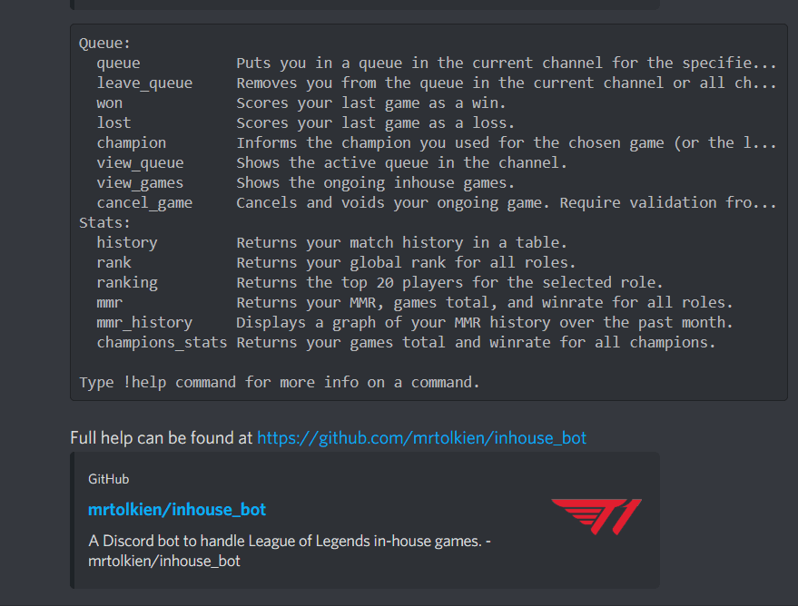

# LoL in-house bot
A Discord bot to handle League of Legends in-house games, with role queue, balanced matchmaking, and basic stats.

# Demo


# Basic use
```
# Enter the channel’s matchmaking queue
!queue mid
>>> 🇲

# Accept queue by reacting to the ready check message
>>> ✅✅✅✅✅✅✅✅✅✅✅
>>> Game 1 has started.

# Games can be scored with !won and !lost
!won
>>> ✅✅✅✅✅✅✅
>>> Game 1 has been scored as a win for blue and ratings have been updated

# Champion played can be added with !champion
!champion riven
>>> Champion for game 1 set to Riven for Tolki

# Your server-wide rank can be seen with !rank
# You can see top players with !ranking
!rank
Role     Rank
-------  ------
Jungle   1st

# MMR and winrate per role can be accessed with !stats
!stats
Role      MMR    Games  Winrate
------  -----  -------  ---------
Jungle   1.43        1  100.00%
```

# Use case and behaviour

This bot is made to be used by trustworthy players queuing regularly for one or two roles.

There is one queue per discord channel the bot is in, but player ratings are common to all channels.

Players can queue in multiple channels and multiple roles. A game starting will drop them from 
all queues in all channels. A player can’t re-enter a queue as long as any game they’re in has not been scored or 
cancelled.

Each player’s role rating is treated as an independent entity, and they all start from the same rating.
The rating system is based on [Microsoft TrueSkill](https://en.wikipedia.org/wiki/TrueSkill).

# Queue features
`!queue role` puts you in the current channel’s queue for the given role.

`!leave` removes you from the channel’s queue for all roles.

`!leave all` removes you from all channel’s queue for all roles.

`!won` scores your last game as a win for your team and waits for validation from at least 6 players from the game.

`!lost` is the counterpart to `!won`.

`!champion champion_name [game_id]` informs which champion you used for winrate tracking.
If you don’t supply the `game_id`, it will apply to your last game.

`!view_queue` shows the queue in the current channel.

`!view_games` shows the ongoing games for all channels.

`!cancel_game` cancels your ongoing game, requiring validation from at least 6 players in the game.
 
# Stats features
`!history` returns your match history.

`!rank` returns your server-wide rank for each role.

`!ranking` returns the top 20 players.

`!mmr` returns your current MMR.

`!mmr_history` displays a graph of your MMR per role in the past month.

`!champions_stats` returns statistics about the champions you played.

`!view_team` returns players in your team. Players in the same team can access their teammate’s stats by using
`!champions_stats user_id`, with `user_id` being their 
[discord id](https://support.discord.com/hc/en-us/articles/206346498-Where-can-I-find-my-User-Server-Message-ID-).

# Admin features
`!admin_score game_id winner` is an admin-only command that scores the game without asking for validation.

`!admin_queue user_id role` is an admin-only command to queue a given user.

`!reset_queue` is an admin-only command to reset the queue.

`!team user_id team_name` puts the chosen user in the given team. This is admin-only for information security.

# Installation
```shell script
git clone https://github.com/mrtolkien/inhouse_bot.git
cd inhouse_bot
pipenv install
pipenv run python run_bot.py
```

# Wanted contributions (2020-05-11)
- `dpytest` does not support reactions to messages, which means the test functions are currently failing.
Any help with mocking those would be greatly welcomed.

- The current data flow needs to be slightly reviewed. The easy way is likely to simply store all ongoing games in memory
before committing them.

- The matchmaking algorithm is currently fully brute-force and can definitely be improved in terms of calculation time.

- Additions to stats visualisations are always welcomed!
